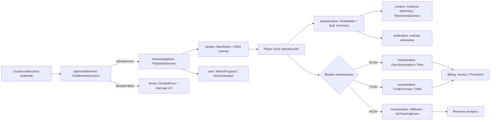

# Modelos de datos OTT compartidos (`@repo/shared`)

## ¿Por qué existen estos modelos?

Estos modelos unifican el lenguaje de negocio entre `api`, `web` y `mobile` para una plataforma OTT (estilo Netflix, HBO o Disney+).

Sin un contrato común, cada app termina definiendo sus propios tipos para lo mismo (`Program`, `Season`, `Subscription`, `PlaybackSession`, etc.), lo que genera:

- inconsistencias de naming y estructura;
- más bugs de integración entre frontend/backend;
- más coste al evolucionar features;
- validaciones y mapeos duplicados.

Con `@repo/shared/src/types`, todos consumen **el mismo contrato**.

---

## Objetivos de diseño

- **Contrato único de dominio**: un solo modelo para catálogo, playback, monetización y usuario.
- **Reutilización real**: tipado compartido en web, api y mobile.
- **Escalabilidad funcional**: soportar VOD, series, live channels, EPG y varios modelos de negocio.
- **Compatibilidad evolutiva**: posibilidad de extender sin romper consumidores existentes.
- **Cero dependencias de plataforma**: solo TypeScript puro (portable en cualquier app del monorepo).

---

## Qué cubre el modelo actual (base + profesional)

## Por qué existe cada categoría y cómo se usa en la OTT

### `content/`

**Por qué existe:** representa el corazón editorial del producto (qué títulos ofreces y cómo se descubren).

**Usabilidad en la OTT:**

- construir home/browse/search con contratos estables;
- mostrar fichas de película/serie/episodio en web, mobile y TV;
- soportar filas personalizadas, recomendaciones y curación editorial;
- operar workflow de publicación sin depender de estructuras internas del CMS.
- soportar localización con campos `...I18n` sin romper payloads legacy.

### `assets/`

**Por qué existe:** separa los recursos multimedia del contenido lógico para escalar encoding/localización.

**Usabilidad en la OTT:**

- resolver posters y thumbnails por dispositivo/resolución;
- seleccionar audio/subtítulos/captions por idioma y accesibilidad;
- servir trailers/clips sin mezclar contratos con playback principal.

### `stream/`

**Por qué existe:** encapsula la entrega de video y el estado real del reproductor.

**Usabilidad en la OTT:**

- iniciar reproducción con manifiestos, perfiles de calidad y DRM;
- monitorizar sesiones, heartbeats y errores de player;
- habilitar live streaming y offline downloads con contratos comunes;
- desacoplar player SDK de la lógica de negocio.

### `transcoding/`

**Por qué existe:** modela el pipeline de preparación de video (antes del playback).

**Usabilidad en la OTT:**

- crear y seguir jobs de codificación (`TranscodeJob`, `TranscodeStatus`);
- definir perfiles de salida por codec/resolución/bitrate (`TranscodeProfile`);
- controlar progreso, tiempos y errores (`TranscodeProgress`, `TranscodeError`);
- publicar outputs listos para HLS/DASH (`TranscodeOutput`);
- integrar eventos operativos del pipeline (`TranscodeEvent`).

### `rights/`

**Por qué existe:** controla autorización real de visionado (quién puede ver qué, dónde y cuándo).

**Usabilidad en la OTT:**

- decidir acceso antes de abrir playback;
- aplicar ventanas de derechos y geobloqueo;
- respetar límites de concurrencia y políticas de dispositivo;
- auditar decisiones de entitlement de forma trazable.

### `epg/`

**Por qué existe:** modela TV lineal y parrilla temporal (programación por canal).

**Usabilidad en la OTT:**

- renderizar guía de canales y próximos programas;
- sincronizar live channels con slots temporales;
- soportar experiencias FAST/Live TV además de VOD.

### `monetization/`

**Por qué existe:** unifica reglas comerciales (SVOD/TVOD/AVOD) y billing.

**Usabilidad en la OTT:**

- evaluar si un contenido requiere plan, compra o anuncios;
- gestionar suscripciones, ofertas y compras puntuales;
- integrar cobros/facturas/promos con proveedores externos;
- medir eventos de ads para revenue y reconciliación.

### `user/`

**Por qué existe:** centraliza identidad y contexto de consumo multiusuario por cuenta.

**Usabilidad en la OTT:**

- manejar perfiles (adult/kids), watchlist y continue watching;
- aplicar control parental con PIN y rating;
- gestionar dispositivos registrados y sesiones activas;
- soportar políticas de seguridad y sign-out remoto.

### `analytics/`

**Por qué existe:** convierte interacción y calidad de experiencia en métricas accionables.

**Usabilidad en la OTT:**

- medir reproducción real (startup, rebuffer, completion);
- detectar incidencias por app/dispositivo/región;
- alimentar recomendación y decisiones de producto.

### `notification/`

**Por qué existe:** estandariza comunicación transaccional y engagement.

**Usabilidad en la OTT:**

- avisar de nuevos episodios, eventos live o cambios de plan;
- controlar estado de lectura y deeplinks internos;
- mantener consistencia de mensajes entre canales (push/email/in-app).
- usar `templateKey + templateParams` con `titleI18n/bodyI18n` para contenido localizado.

### `geolocation/` y `location/`

**Por qué existe:** separa datos geográficos del motor de decisiones geopolíticas.

**Usabilidad en la OTT:**

- enriquecer contexto de usuario/región;
- aplicar políticas de cumplimiento por país;
- resolver disponibilidad sin duplicar reglas por app.

### `errors/`

**Por qué existe:** evita errores ambiguos y dispersos entre servicios/apps.

**Usabilidad en la OTT:**

- mapear códigos de error a UX y observabilidad;
- distinguir errores recuperables vs fatales;
- acelerar soporte y troubleshooting con semántica común.
- habilitar mensajes localizados por mercado (`messageI18n`, `userMessageI18n`).

### `i18n/`

**Por qué existe:** define primitives de localización reutilizables para todos los dominios.

**Usabilidad en la OTT:**

- estandarizar mapas de traducción (`LocalizedStringMap`);
- centralizar contexto de idioma por request/perfil (`LocalizationContext`);
- resolver idioma final de render de forma consistente (`LocaleResolutionInput`, `ResolvedLocale`);
- soportar negociación de idioma por cabeceras HTTP (`RequestLocaleHeaders`, `RequestLocaleContext`);
- evitar que cada equipo invente su propio formato i18n.

Flujo recomendado cliente -> API:

- `Accept-Language`: idioma preferido del cliente/navegador;
- `X-Locale`: override explícito elegido por usuario (si existe);
- `X-Fallback-Locale`: fallback deseado cuando no haya traducción.

La API resuelve el locale final y devuelve contenido ya localizado con `ResolvedLocale`.

### `contract/`

**Por qué existe:** permite evolucionar el esquema sin romper consumidores.

**Usabilidad en la OTT:**

- versionar payloads compartidos;
- orquestar deprecaciones de forma controlada;
- habilitar compatibilidad progresiva entre versiones de apps/backend.

### `content/`

Modela el catálogo editorial:

- programas (`Program`), temporadas/episodios (`Season`, `Episode`);
- metadata localizable (`ProgramMetadata`, `LocalizedText`);
- descubrimiento (`Genre`, `Tag`, `DiscoveryCategory`);
- estructura de home/browse por filas (`ContentRow`) y páginas (`ContentPage`).

### `assets/`

Modela los recursos de media y artwork:

- posters, thumbnails, trailers, clips;
- pistas de audio;
- subtítulos y captions;
- video/renditions.

### `stream/`

Modela reproducción:

- fuentes de stream (`StreamSource`);
- manifiestos HLS/DASH (`StreamManifest`);
- DRM (`DrmConfig`);
- perfiles de calidad (`StreamQualityProfile`);
- sesión de reproducción (`PlaybackSessionDto`);
- live y chat para eventos en directo.

También cubre operación profesional de player:

- sesión y estado detallado (`PlaybackSession`, `PlayerState`);
- heartbeats y errores (`PlaybackHeartbeat`, `PlaybackError`);
- licencias DRM (`DrmLicenseToken`, `DrmLicenseRequestDto`);
- descargas offline (`DownloadItem`, `OfflineLicense`, `DownloadEntitlement`).

### `transcoding/`

Modela la cadena de procesamiento de vídeo:

- perfiles de transcodificación (`TranscodeProfile`);
- jobs e inputs/outputs (`TranscodeJob`, `TranscodeInput`, `TranscodeOutput`);
- progreso, estados y errores (`TranscodeProgress`, `TranscodeStatus`, `TranscodeError`);
- eventos y DTO de creación (`TranscodeEvent`, `CreateTranscodeJobDto`).

### `epg/`

Modela TV lineal y guía electrónica:

- canales (`EpgChannel`);
- slots/programación (`EpgSlot`, `EpgSchedule`);
- respuesta de grilla (`EpgResponseDto`).

### `monetization/`

Modela los tres enfoques OTT principales:

- **SVOD**: planes y suscripción (`SvodPlan`, `UserSubscription`);
- **TVOD**: ofertas y compras (`TvodOffer`, `TvodPurchase`);
- **AVOD**: pausas publicitarias, decisión y tracking (`AdBreak`, `AdDecision`, `AdTrackingEvent`).

Incluye además billing profesional:

- métodos de cobro (`BillingMethod`);
- facturas (`Invoice`);
- promociones (`Promotion`).

### `user/`

Modela cuenta y experiencia de consumo:

- usuario y perfiles (`User`, `UserProfile`, `UserRole`);
- seguimiento de reproducción (`WatchProgress`);
- watchlist (`WatchlistItem`);
- paginación genérica (`PaginatedResult<T>`);
- dispositivos y sesiones activas (`RegisteredDevice`, `ActiveSession`);
- control parental (`ProfileParentalControl`).

### `rights/`

Modela autorización real de consumo:

- derechos por usuario/perfil y programa (`ContentEntitlement`);
- ventanas de disponibilidad (`EntitlementWindow`);
- restricciones geográficas y de concurrencia/dispositivo;
- decisión final de acceso (`EntitlementDecision`).

### `analytics/`, `notification/`, `geolocation/`, `location/`

Modelos auxiliares para eventos, notificaciones y reglas geo.

Además:

- métricas QoE (`QoeStartupMetric`, `QoeRebufferMetric`, `QoeSummary`).

### `content/` avanzado

Además del catálogo base, incluye:

- búsqueda/facetas (`SearchDocument`, `SearchQueryDto`);
- recomendación y razones de ranking (`RecommendationShelf`, `RecommendationItem`);
- workflow editorial y auditoría (`EditorialStatus`, `EditorialAuditLog`).

### Estado actual multidioma

El modelo ya contempla multidioma en:

- metadata de contenido (`availableLocales`, `localizedText`, `localizedFields`);
- etiquetas editoriales (`titleI18n`, `subtitleI18n`, `labelI18n`);
- EPG (`nameI18n`, `titleI18n`);
- notificaciones (`titleI18n`, `bodyI18n`, `templateKey`);
- perfil de usuario (`language`, `preferredLocale`, `fallbackLocale`);
- cabeceras de request (`accept-language`, `x-locale`, `x-fallback-locale`);
- errores de dominio (`messageI18n`, `userMessageI18n`).

Para compatibilidad, se mantienen campos base (`title`, `label`, `message`) como fallback.

### `errors/` y `contract/`

Gobernanza de contrato y operación:

- taxonomía de errores de dominio (`DomainError`);
- versionado del payload (`ContractVersion`, `VersionedPayload<T>`).

---

## Beneficios para el equipo

- Menos fricción entre equipos frontend/backend.
- Más velocidad para construir features (tipos listos para usar).
- Menor riesgo de regresiones de contrato.
- Mejor mantenibilidad del dominio OTT en el tiempo.
- Observabilidad y soporte técnico más rápidos (QoE + errores de dominio).
- Evolución segura del contrato entre versiones.

---

## Reglas prácticas al extender estos tipos

1. Añadir nuevos tipos por dominio (`content`, `stream`, etc.).
2. Exportarlos siempre desde `src/index.ts`.
3. Mantener nombres de negocio claros y consistentes.
4. Evitar acoplar tipos a frameworks/librerías específicas.
5. Si un cambio rompe contrato, introducir versión o campo opcional para transición.
6. Modelar explícitamente estados operativos (playback, billing, entitlement) para evitar lógica implícita en cada app.

---

## Uso recomendado

Importar siempre desde el barrel:

```ts
import type {
	Program,
	ContentRow,
	PlaybackSessionDto,
	UserSubscription,
} from '@repo/shared';
```

Así se garantiza que todas las apps comparten exactamente el mismo contrato de datos.

## Mocks de referencia

Se incluyen mocks tipados por dominio en `packages/shared/src/mocks` para facilitar:

- prototipado rápido en web/mobile;
- pruebas de integración en api;
- ejemplos de payload para onboarding técnico.

Entrada principal de mocks: `packages/shared/src/mocks/index.ts`.

---

## Diagrama de flujo OTT (onboarding)



    ---

    ## Diagrama de transcodificación (ingest -> encode -> package -> publish)

    ```mermaid
    sequenceDiagram
    	autonumber
    	participant CMS as CMS/API
    	participant Queue as Transcode Queue
    	participant Worker as Transcode Worker
    	participant Packager as Packaging Service
    	participant Storage as Media Storage/CDN
    	participant Catalog as Catalog Service

    	CMS->>Queue: CreateTranscodeJobDto(programId, sourceUrl, profileIds)
    	Queue-->>CMS: TranscodeJob(status=queued)

    	Queue->>Worker: TranscodeJob(status=processing, stage=ingest)
    	Worker->>Storage: Pull source asset (TranscodeInput.sourceUrl)
    	Worker-->>Queue: TranscodeProgress(stage=analyze, percent=10)

    	loop Por cada TranscodeProfile
    		Worker->>Worker: Encode video/audio renditions
    		Worker-->>Queue: TranscodeProgress(stage=encode, percent=20..80)
    	end

    	Worker->>Packager: Generate HLS/DASH outputs
    	Packager->>Storage: Publish manifests + segments
    	Packager-->>Queue: TranscodeProgress(stage=package, percent=90)

    	Queue->>Worker: Confirm publish stage
    	Worker-->>Queue: TranscodeOutput(manifestHlsUrl, manifestDashUrl, renditions)
    	Queue-->>CMS: TranscodeJob(status=completed, completedAt)

    	CMS->>Catalog: Link StreamSource to new outputs
    	Catalog-->>CMS: Program ready for playback

    	alt Error en cualquier etapa
    		Worker-->>Queue: TranscodeError(code, message, retryable)
    		Queue-->>CMS: TranscodeJob(status=failed)
    	end
    ```
